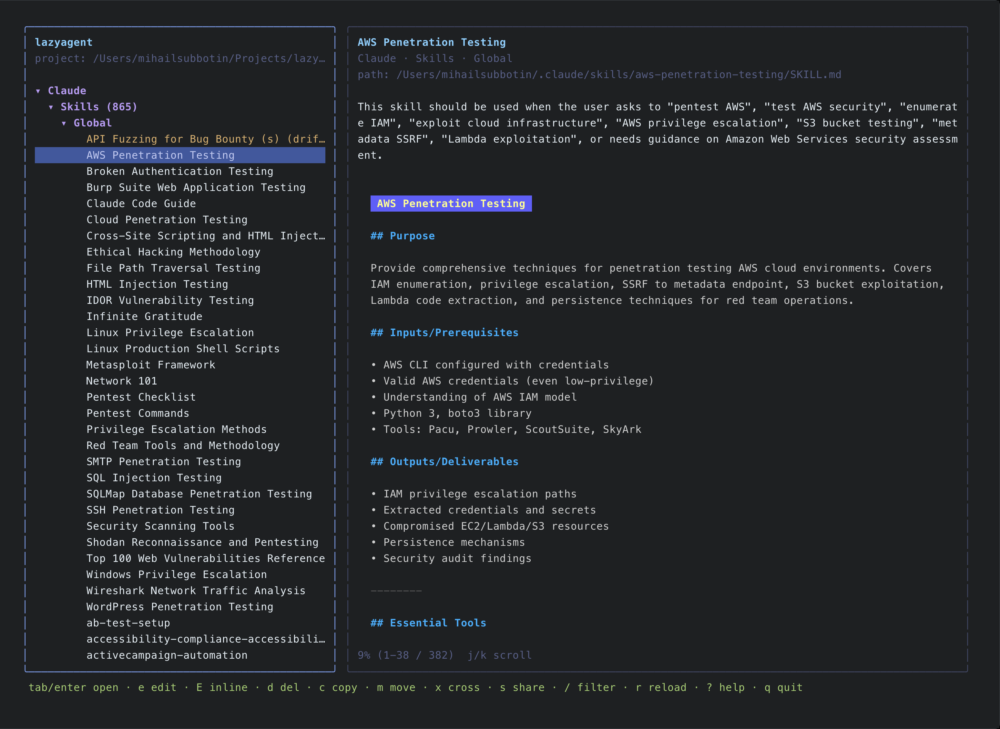
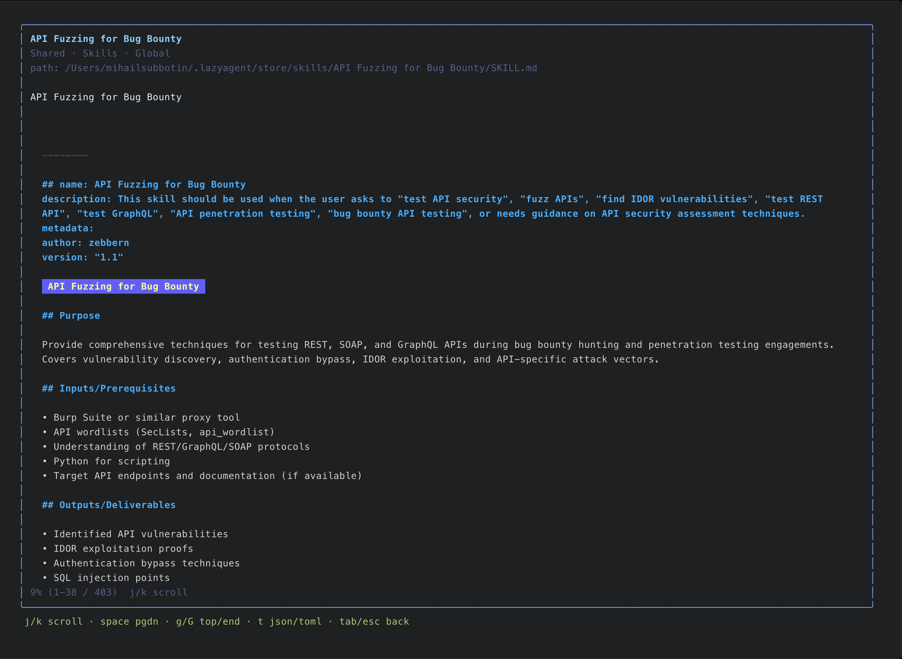

# lazyagent

> A lazygit-style TUI for managing skills, subagents, MCP servers, prompts and memory across **Claude Code**, **Codex** and **Gemini CLI** — one tree, one hotkey to share between tools.

<p align="center">
  
</p>

<!--
animated demo (PRI-15): replace the static screenshot with an asciinema embed
or assets/demo.gif once recorded.
-->

---

## Why

Three CLIs, three home directories, three ways of doing the same thing. If you use Claude Code, Codex and Gemini CLI in the same week you end up with:

- **Three parallel hierarchies** — `~/.claude/`, `~/.codex/` (+ `~/.agents/`), `~/.gemini/` — each with its own skills/, agents/, prompts/, memory file and MCP config.
- **Duplicates by hand**: the only way to use a skill in all three tools is to `cp -r` it, which forks the moment you edit one copy.
- **No common view**: there's no way to see at a glance which prompts you have, which MCP servers are wired up, or which agent is project-local vs global.

`lazyagent` puts all of that in a single tree, supports cross-tool copy with format conversion where needed, and — once you opt in — projects a single canonical version into every tool via symlinks (or copies on cloud-synced volumes), so editing one place updates everywhere.

## Install

### Homebrew (macOS arm64 / amd64)

<!-- PRI-8 ships the tap; until then this command will 404. -->
```bash
brew install mi-subbotin/tap/lazyagent
```

> First launch on macOS triggers Gatekeeper. Right-click the binary → **Open**, or `xattr -d com.apple.quarantine $(which lazyagent)`. Codesigning / notarization is on the roadmap but not yet shipped.

### `go install`

```bash
go install github.com/mi-subbotin/lazyagent/cmd/lazyagent@latest
```

### Pre-built binaries

Download from the [latest release](https://github.com/mi-subbotin/lazyagent/releases/latest) — `darwin-arm64` and `darwin-amd64` archives include a single `lazyagent` binary. Linux and Windows builds are tracked in the roadmap.

## Quickstart

```bash
cd ~/Projects/your-project   # or anywhere
lazyagent
```

The tree is grouped **Origin → Kind → Scope**:

```
Claude
  Skills
    Global  (3)
    Local   (1)
  Agents
  ...
Codex
  ...
Gemini
  ...
Shared              ← appears once you press `s` to canonicalise an item
```

Local-scope rows show only when `lazyagent` is launched from a directory that contains tool markers (`.claude/`, `.codex/`, `.gemini/`, `AGENTS.md`, `CLAUDE.md`, `GEMINI.md`, `.mcp.json`). Otherwise local sections are hidden — there's no project to attach to.

## Features

| Feature                                    | Claude | Codex | Gemini |
| ------------------------------------------ | :----: | :---: | :----: |
| Skills (`SKILL.md` + assets)               |   ✓    |   ✓   |   ✓    |
| Subagents                                  |   ✓    |   ✓ ¹ |   ✓    |
| MCP servers                                |   ✓    |   ✓   |   ✓    |
| Prompts / slash commands                   |   ✓    |   ✓   |   ✓ ²  |
| Memory file (`CLAUDE.md`/`AGENTS.md`/...)  |   ✓    |   ✓   |   ✓    |
| Cross-tool copy (`x`)                      |   ✓    |   ✓   |   ✓    |
| Inline edit (`E`) + external editor (`e`)  |   ✓    |   ✓   |   ✓    |
| Shared canonical store + projection (`s`)  |   ✓    |   ✓ ³ |   ✓ ³  |
| Drift detection + resync (`R`)             |   ✓    |   ✓   |   ✓    |

¹ Codex agents are stored as `[profiles.<name>]` entries in `config.toml`; cross-tool copy converts the body, lossy in either direction.<br>
² Gemini commands are TOML; cross-copy from Claude/Codex (markdown) requires a frontmatter → TOML rewrite.<br>
³ Codex agents and Gemini prompts can't be shared yet without format conversion — the share picker greys them out.

## Keys

```
  j/k      navigate up/down (scroll body in detail)
  h/l      collapse / expand group
  tab      open item full-screen / back out (toggle)
  enter    same as tab (drill into item or expand group)
  space    page down in fullscreen detail
  g / G    jump to top / end in fullscreen detail
  /        filter items by name/description
  esc      clear filter / cancel filter editor / cancel confirm
  t        toggle JSON / TOML for MCP entries
  d        delete item (asks y/n)
  c        copy item to the other scope (Global ↔ Local)
  m        move item to the other scope
  x        cross-tool copy (pick target Origin / scope)
  s        share to lazyagent store + project to selected tools
  R        resync drifted shared item (canonical / tool wins)
  e        open in $EDITOR (external)
  E        edit in built-in editor (ctrl+s save · esc cancel)
  n        create new Skill / Agent / Prompt
  r        reload all sources
  ?        toggle this help (in-app)
  q        quit
```

`lazyagent` — read-only by default for everything it doesn't recognise. Editing actions are explicit and confirm before destructive ops.

## Shared store

The shared store at `~/.lazyagent/store/` holds one canonical copy of each item you've opted into sharing. `lazyagent` creates it on first launch — no separate `init` step.

```
~/.lazyagent/store/
  skills/<name>/{SKILL.md, manifest.toml, ...}
  agents/<name>/{agent.md, manifest.toml}
  prompts/<name>/{prompt.md, manifest.toml}
  memory/<name>/{memory.md, manifest.toml}
  mcp/...                 (deferred to v0.2)
```

Pressing `s` on any per-tool item opens a multi-select picker (`[x] Claude  [x] Codex  [x] Gemini`), moves the bytes into the store, and projects them back to each selected tool — symlink by default, byte-copy on iCloud / Dropbox / OneDrive / Google Drive volumes where symlinks don't sync. Pressing `s` again on a shared item lets you change the projection set; pressing `R` on an item the detector flagged with `(drift)` opens the canonical-vs-tool resync overlay.

<p align="center">
  
</p>

## Configuration

Optional. `lazyagent` works out of the box with no config file at all — every option below has a baked-in default. When you want to override something, run `lazyagent config init` to seed `~/.lazyagent/config.toml`, then edit it (`lazyagent config edit` is a shortcut for `$EDITOR`).

```toml
[search]
roots            = ["$HOME"]                        # PRI-4 global indexer roots
ignore_paths     = []                               # PRI-10 .gitignore-style excludes
follow_symlinks  = false

[ui]
theme            = "tokyonight"                     # tokyonight | catppuccin | nord
default_mode     = "cwd"                            # cwd | global
display_mode     = "origin"                         # origin | local-grouped
default_origin   = "all"                            # all | claude | codex | gemini

[tools]
claude           = true
codex            = true
gemini           = true
shared           = false

[install]
cache_dir        = "~/.lazyagent/cache"             # PRI-3 GitHub-install cache
gc_after_days    = 30

[updates]
check_interval_days = 7                             # PRI-19 release check cadence
notify              = true

[logging]
level            = "warn"                           # debug | info | warn | error
file             = "~/.lazyagent/logs/lazyagent.log"
format           = "text"                           # text | json
```

CLI helpers:

| Command                       | What it does                                                  |
| ----------------------------- | ------------------------------------------------------------- |
| `lazyagent config init`       | Write the defaults above to `~/.lazyagent/config.toml`. Refuses if the file exists; pass `--force` to overwrite. |
| `lazyagent config show`       | Print the effective config (defaults + your overrides) to stdout. |
| `lazyagent config edit`       | Open the file in `$EDITOR` (creates it from defaults first if missing). |
| `lazyagent config validate`   | Parse the file, list unknown keys and invalid enum values, exit non-zero on any. |

Partial files are fine — only put the keys you want to override; everything else stays at the default. Unknown keys and invalid enum values become warnings on stderr and the offender resets to its default rather than aborting startup.

## Shell completions

`lazyagent completion <bash|zsh|fish>` prints the completion script for the chosen shell to stdout.

Homebrew installs all three automatically — restart your shell after `brew install` and tab-completion just works.

For non-brew installs:

```bash
# bash (one-shot, current shell)
source <(lazyagent completion bash)

# bash (persistent, system-wide on macOS)
lazyagent completion bash | sudo tee /opt/homebrew/etc/bash_completion.d/lazyagent > /dev/null

# zsh (persistent — pick any directory in $fpath)
lazyagent completion zsh > "${fpath[1]}/_lazyagent"

# fish
lazyagent completion fish > ~/.config/fish/completions/lazyagent.fish
```

Completions cover all subcommands (`config / logs / shared / completion`) and the global flags (`--mock`, `--verbose`/`-v`, `--log-file`, `--log-format`).

## Troubleshooting

`lazyagent` writes a structured log to `~/.lazyagent/logs/lazyagent.log` (rotated daily, kept for a week). Adapter parse failures, edit/copy/share/delete actions and startup metadata land there — nothing ever goes to stdout/stderr while the TUI is running, so the altscreen stays clean.

```bash
lazyagent --verbose                  # bump log level to debug for the next run
lazyagent logs path                  # print the resolved log file path
lazyagent logs tail                  # last 50 lines of the active log
lazyagent logs tail -n 200           # more lines
lazyagent logs clean                 # remove the active log + rotated siblings
```

Override location and format on a per-run basis:

```bash
lazyagent --log-file /tmp/lz.log --log-format json
```

For bug reports, please attach `lazyagent logs tail` output — the [`bug_report`](.github/ISSUE_TEMPLATE/bug_report.yml) issue form has a dedicated field for it.

## Roadmap

- [x] Read-only TUI MVP across Claude / Codex / Gemini
- [x] Cross-tool copy with conflict pre-flight (`x`)
- [x] Inline editor with mtime conflict detection (`E`)
- [x] Shared canonical store + symlink projector + drift detection (`s` / `R`)
- [ ] [Backlog: editing all tool-specific configs from one place (`PRI-1`)](https://linear.app/obscurectl/issue/PRI-1)
- [ ] [Backlog: GitHub install for skills / agents (`PRI-3`)](https://linear.app/obscurectl/issue/PRI-3)
- [ ] [Backlog: Global search across the whole tree (`PRI-4`)](https://linear.app/obscurectl/issue/PRI-4)
- [ ] [Backlog: Browse historical sessions across tools (`PRI-5`)](https://linear.app/obscurectl/issue/PRI-5)
- [ ] [Backlog: One-button sync of every shareable item (`PRI-27`)](https://linear.app/obscurectl/issue/PRI-27)

## Privacy

`lazyagent` runs entirely local. It reads files from your home directory and your project, writes only when you trigger an explicit action (delete / copy / move / cross / share / resync / edit), and makes **no network calls**. No telemetry, no analytics, no opt-out toggle because there's nothing to opt out of.

## Contributing

Bug reports and feature requests via [GitHub Issues](https://github.com/mi-subbotin/lazyagent/issues). PRs welcome — please open an issue first to discuss scope. Read [`VISION.md`](VISION.md) for what's in scope and what isn't, [`ARCHITECTURE.md`](ARCHITECTURE.md) for a codebase tour, and [`CONTRIBUTING.md`](CONTRIBUTING.md) for the workflow. Participation is governed by the [Code of Conduct](CODE_OF_CONDUCT.md).

## License

[Apache-2.0](LICENSE) — see also [NOTICE](NOTICE) for attribution requirements when redistributing modified versions.
